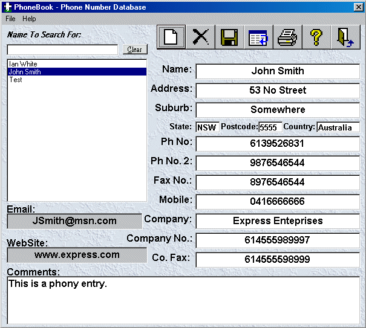



## A 0 PhoneBook

### Description

Provides a simple to use, yet useful phonebook/contacts program. I have gone through and sussed out pretty much every bug I could think of, see if you can find any!
 
### More Info
 
Unzip it into c:\PhoneBook otherwise there may be a couple of problems. I am going to fix this for the next version release. Previous versions of PhoneBook are available from me via request. vkcommodore@excite.com

             |
---                |---
**Submitted On**   |2000-12-04 22:39:58
**By**             |[Ian White](https://github.com/Planet-Source-Code/PSCIndex/blob/master/ByAuthor/ian-white.md)
**Level**          |Intermediate
**User Rating**    |4.5 (98 globes from 22 users)
**Compatibility**  |VB 3\.0, VB 4\.0 \(16\-bit\), VB 5\.0, VB 6\.0
**Category**       |[Databases/ Data Access/ DAO/ ADO](https://github.com/Planet-Source-Code/PSCIndex/blob/master/ByCategory/databases-data-access-dao-ado__1-6.md)
**World**          |[Visual Basic](https://github.com/Planet-Source-Code/PSCIndex/blob/master/ByWorld/visual-basic.md)
**Archive File**   |[CODE\_UPLOAD123121242000\.zip](https://github.com/Planet-Source-Code/ian-white-a-0-phonebook__1-13307/archive/master.zip)

